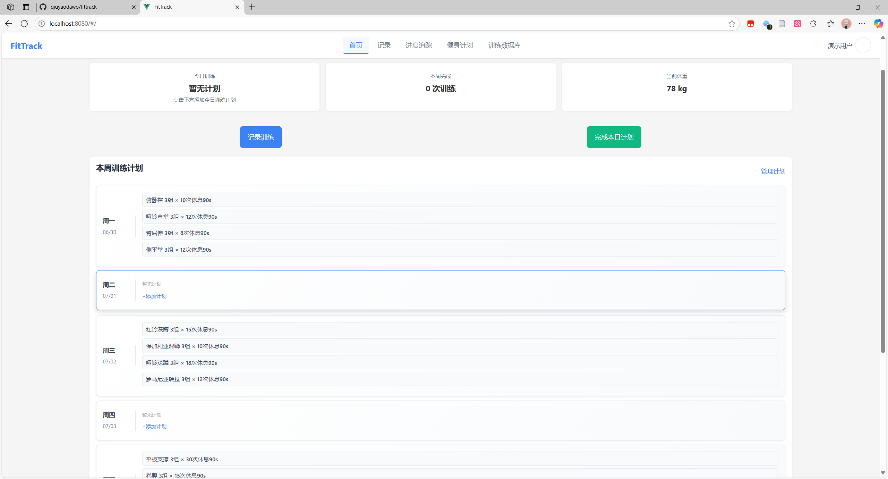
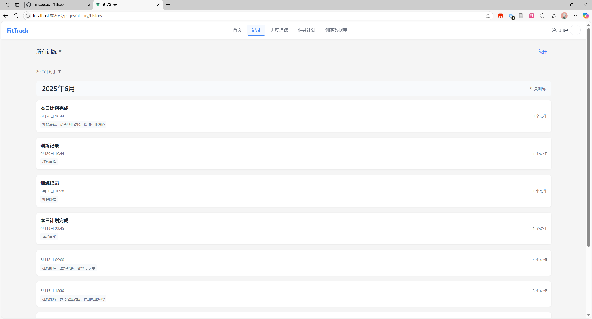
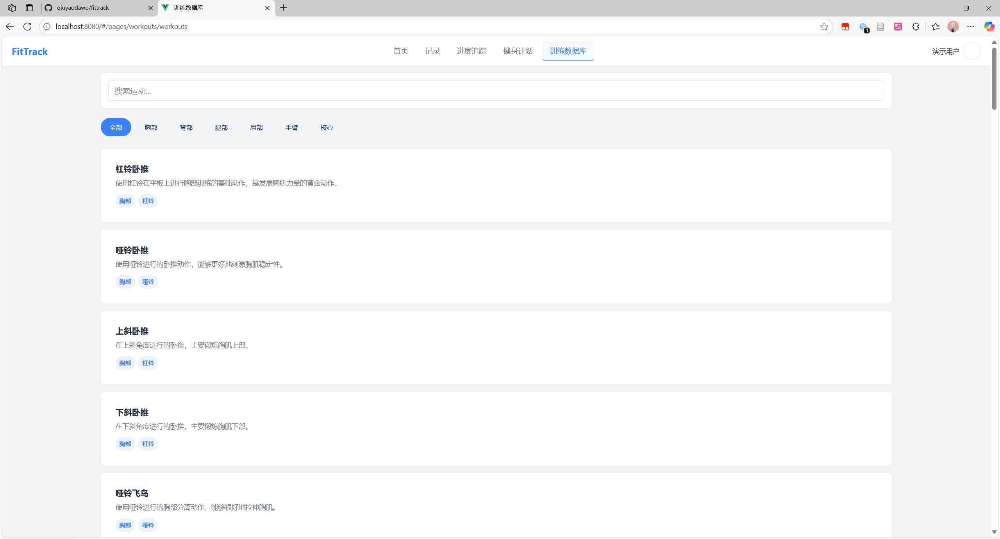

#  FitTrack 健身追踪应用

一款简洁、跨平台的健身追踪应用，旨在帮助您科学地记录、追踪并优化每一次训练。

---

## ✨ 主要功能 (Features)

- **用户系统**: 支持完整的注册与登录流程。
- **训练记录**: 轻松记录每个动作的组数、次数、重量和休息时间。
- **历史追踪**: 查看详细的训练历史，回顾每一次的努力。
- **进度可视化**: 通过图表直观地看到自己在关键动作上的力量增长。
- **离线支持与云同步**: 无网络时数据自动保存在本地，联网后与云端同步，确保数据不丢失。
- **跨平台**: 基于 `uni-app` 构建，一套代码可发布到 H5、App 和小程序等多个平台。

## 📸 应用截图 (Screenshots)

<p align="center">
  &nbsp;
  &nbsp;
  &nbsp;
</p>

## 🛠️ 技术栈 (Tech Stack)

- **前端**: uni-app, Vue.js, uni-ui
- **后端**: Node.js, Express.js
- **数据库**: SQLite

---

## 🚀 快速上手 (Getting Started)

### 1. 先决条件

- 安装 [Node.js](https://nodejs.org/) (v16.x 或更高版本)
- 安装 [HBuilderX](https://www.dcloud.io/hbuilderx.html)

### 2. 后端服务启动

```bash
# 进入后端目录
cd server

# 安装依赖
npm install

# 启动服务
node server.js

# (可选) 如果需要演示数据，请运行初始化脚本
# 演示账号：demo@fittrack.com 密码：demo123
# node init-demo-data.js
```
服务器将在 `http://localhost:3000` 上运行。

### 3. 前端应用运行

1.  使用 HBuilderX 打开 `fittrack` 项目根目录。
2.  在 HBuilderX 菜单栏选择 “运行” -> “运行到浏览器” -> “Edge”。

## 📁 项目结构

```
fittrack/
├── server/                # 后端服务 (Node.js, Express)
├── pages/                 # 应用页面 (Vue)
├── components/            # 可复用组件
├── uni_modules/           # uni-app 插件
├── static/                # 静态资源 (图片, 字体)
├── utils/                 # 工具函数
├── main.js                # 应用入口
├── App.vue                # 应用根组件
└── manifest.json          # uni-app 配置文件
```

## 📄 许可证 (License)

本项目采用 [MIT License](./LICENSE) 开源许可证。
